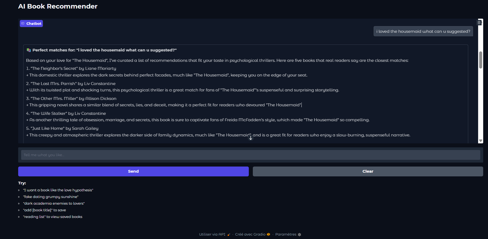

# AI Book Recommender Pro – Project Report & README

**A smart, interactive book recommendation system powered by modern AI techniques**

### Tech Stack

| Component             | Technology Used                            |
| --------------------- | ------------------------------------------ |
| **LLM Inference**     | Groq API (Llama-3.3-70b-versatile)         |
| **Embeddings**        | Sentence Transformers (`all-MiniLM-L6-v2`) |
| **Frontend / UI**     | Gradio (Blocks + Chatbot)                  |
| **Book Data Sources** | Google Books API + Open Library API        |
| **Core Language**     | Python 3.12                                |
| **Vector Similarity** | scikit-learn (cosine similarity)           |

### Project Overview

This project is an AI-powered book recommendation chatbot that allows users to request books in natural language and receive personalized recommendations instantly.

Unlike traditional keyword-based recommenders, this system combines:

- **Large Language Model** understanding (via Groq's fast Llama models) for deep intent recognition
- **Semantic search & reranking** using embeddings for better relevance
- **Live book metadata** (covers, ratings, descriptions) from real web APIs
- **Interactive chat features** (save books, view reading list)

The result is a fun, accurate, and visually appealing book discovery tool that feels like talking to a knowledgeable friend.

### Key Features

- **Natural Language Queries**  
  Users can type anything:

  - "I want a book like The Housemaid"
  - "fake dating grumpy sunshine YA romance"
  - "something dark and twisted like Freida McFadden"
  - "enemies to lovers like Betting on You"

- **Smart Recommendations**  
  Powered by LLM with carefully tuned prompts to prioritize:

  - Same-author books when applicable
  - Exact trope/genre matches
  - Current BookTok/Goodreads trends
  - Correct age group (YA vs adult)

- **Reading List Management**  
  Built-in commands:

  - `add [book title]` → saves to personal list
  - `reading list` → shows all saved books with details

- **Fast & Responsive**  
  Uses Groq's ultra-fast inference (responses in <5 seconds)

### Technical Architecture

User Input ↓
Gradio Chat Interface ↓
AIBookRecommender.chat() ↓
→ Intent extraction (LLM + regex fallbacks) ↓
→ Smart query generation ↓
→ Search Google Books + Open Library APIs ↓
→ Semantic reranking (SentenceTransformer embeddings) ↓
→ Final filtering & selection ↓
→ LLM generates personalized "Why you'll love it" reasons ↓
Formatted response with covers + commands

**Core Components**:

- `OpenSourceLLM`: Wrapper for Groq API (Llama-3.3-70b-versatile)
- `BookSearchEngine`: Multi-source book data fetching
- `AIBookRecommender`: Main logic with intent extraction, reranking, and response formatting
- `Gradio Blocks`: Clean, modern chat UI with message history support

### How to Run Locally

1. **Clone the repository**

git clone https://github.com/MarouaBouderka/Book-recommendation-system.git
cd ai-book-recommender-pro

2. Install dependencies

Get a free Groq API key
Visit: https://console.groq.com/keys → Create new key

3. Set your API key

export GROQ_API_KEY="your_key_here"

4. Run the app

python app.py ((or run all cells in the Jupyter/Colab notebook))

### Future Improvements (Ideas)

Integrate Goodreads API for more accurate ratings/reviews
Add "more like this" button for individual books
Support book previews or purchase links
Multi-language recommendations
User profiles / long-term reading history
